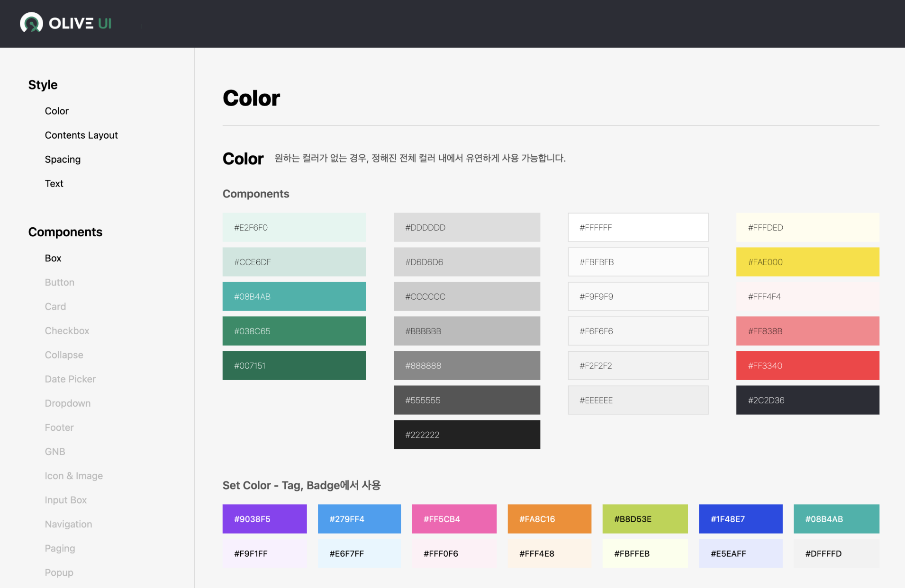

# OLIVE UI
OLIVE UI는 [OLIVE Platform](https://olive.kakao.com/)의 디자인을 제공하는 오픈소스 프로젝트입니다.<br/>
~~컴포넌트들은 매월 첫째 주 수요일에 추가하여 순차적으로 공개할 예정입니다.~~ ***프로젝트 컨셉 재논의로 홀딩합니다.***

<br/>
<hr />

[](./LICENSE) [](./CONTRIBUTING.md)


OLIVE Platform은 [angular](https://angular.io/)와 [tailwindcss](https://tailwindcss.com/)를 기반으로 작성되었습니다.<br/>
[Angular CLI](https://github.com/angular/angular-cli)는 버전 13.2.2를 사용합니다.<br/><br/>

## 기여 ✨
OLIVE UI 프로젝트는 모든 기여를 환영합니다.<br/>
이 프로젝트의 목적은 OLIVE UI를 계속 발전시켜, 누구나 쉽고 빠르게 사용할 수 있도록 하는 것입니다.<br/>
OLIVE UI는 오픈소스로 진행하는 프로젝트이며, 버그 수정 및 개선에 기여한/기여할 분께 미리 감사드립니다.<br/>
이 프로젝트에 대한 자유로운 의견이나 버그 리포팅, 컴포넌트 기능 등을 추가하려고 한다면 [Pull Requests](https://github.com/kakao/olive-ui/pulls)로 제출해주세요.

<br/>


## 기여 지침 
다음은 OLIVE UI 프로젝트에 기여하기 위한 일련의 지침입니다.<br>
OLIVE UI 개선에 참여할 방법을 알아보려면 [CONTRIBUTING.md](./CONTRIBUTING.md) 를 참고해 주세요.<br>
기여나 개선은 [Pull Requests](https://github.com/kakao/olive-ui/pulls) 와 [GitHub Issues](https://github.com/kakao/olive-ui/issues)로 만들어 제출할 수 있습니다.<br/>
OLIVE UI 프로젝트에 참여하는 모든 사람은 [Code of Conduct](./CODE_OF_CONDUCT.md)의 적용을 받습니다.<br>

<br/>

## 설치 📣

```
git clone git@github.com:kakao/olive-ui.git
```
<br/>

## 기여자 🏆
OLIVE UI에 [기여를 해주신 분](https://github.com/kakao/olive-ui/graphs/contributors)들께 감사드립니다.❤️

<br/>

## License
This software is licensed under the [Apache 2 license](https://github.com/kakao/khaiii/blob/master/LICENSE), quoted below.

Copyright 2022 Kakao Corp. [http://www.kakaocorp.com](http://www.kakaocorp.com/)

Licensed under the Apache License, Version 2.0 (the "License"); you may not use this project except in compliance with the License. You may obtain a copy of the License at http://www.apache.org/licenses/LICENSE-2.0.

Unless required by applicable law or agreed to in writing, software distributed under the License is distributed on an "AS IS" BASIS, WITHOUT WARRANTIES OR CONDITIONS OF ANY KIND, either express or implied. See the License for the specific language governing permissions and limitations under the License.

